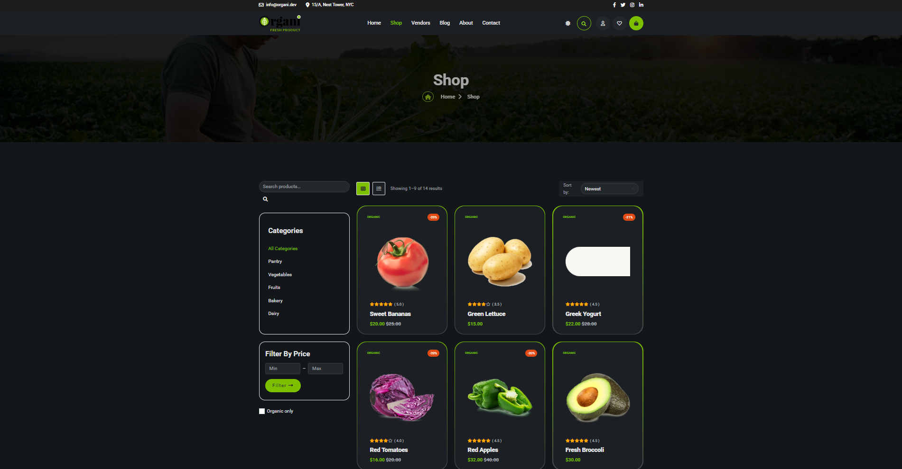
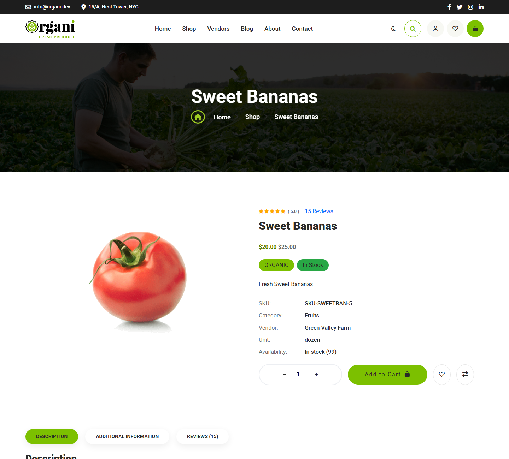
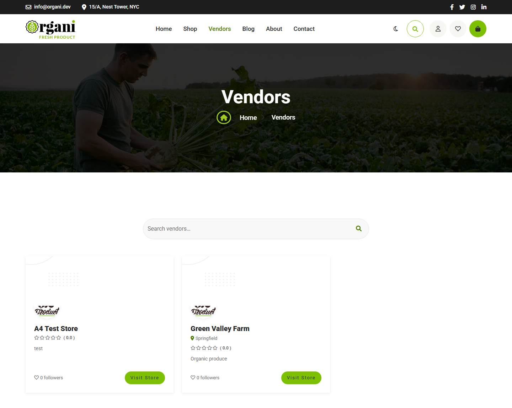
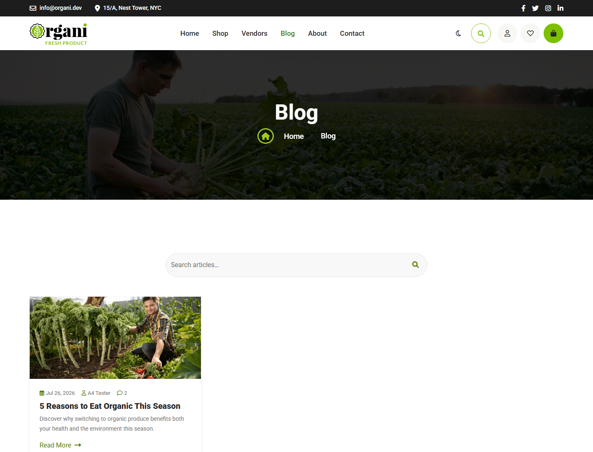
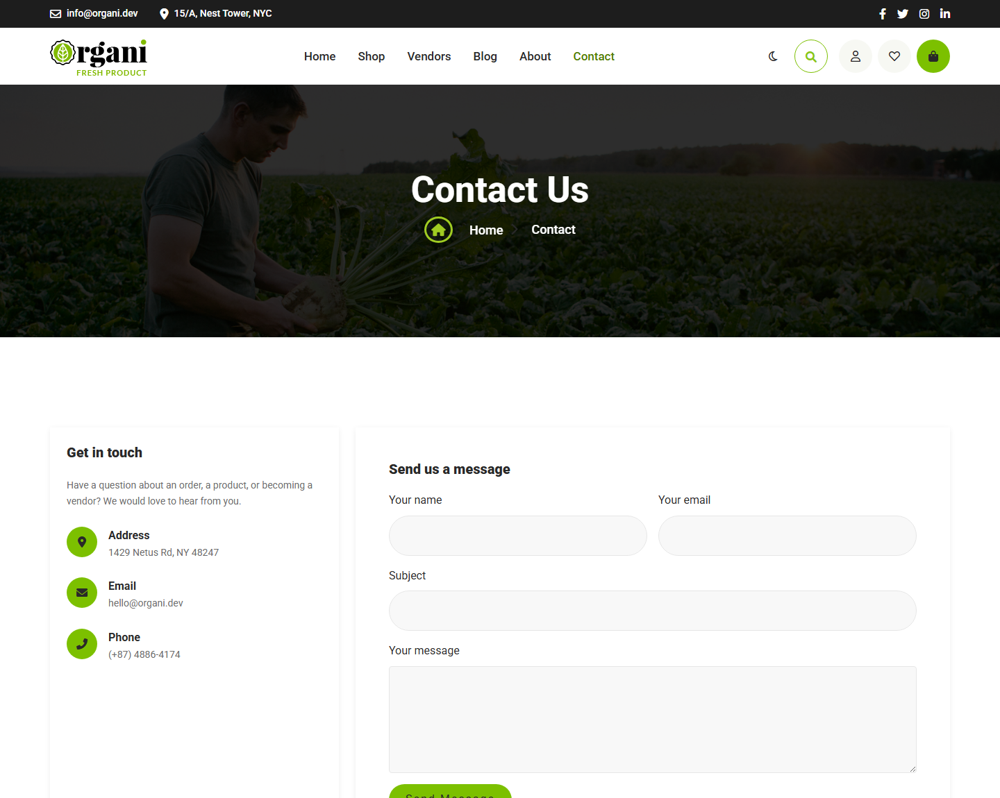
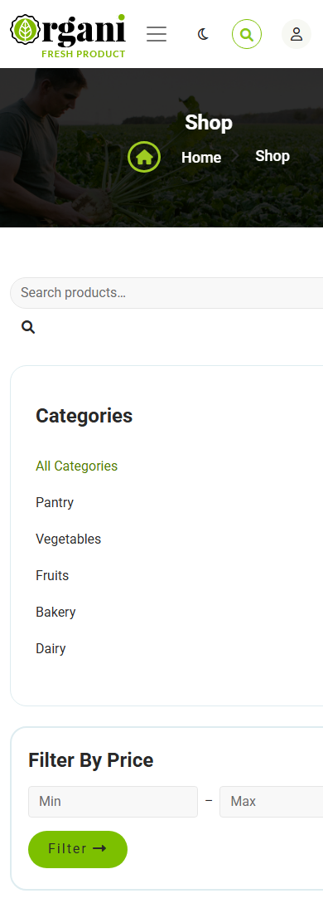
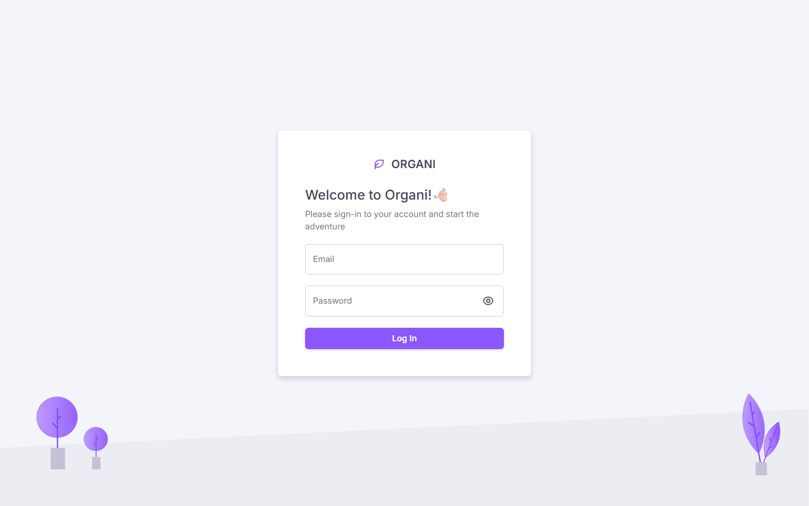

<div align="center">

# 🌿 Organi

**A full-stack organic marketplace — multi-vendor storefront and admin dashboard.**

.NET 10 · Clean Architecture · CQRS/MediatR · EF Core · SQL Server · Next.js 14 · TypeScript

</div>

---

Organi is a production-shaped e-commerce application built as a monorepo: a **.NET 10 Web API** following Clean Architecture with CQRS, and a **Next.js 14 App Router** frontend that serves two distinct interfaces from one codebase — a customer storefront and an admin dashboard.

<p align="center">
  
  <em>Product catalogue with faceted filters, in dark mode</em>
</p>

## Contents

- [Features](#features)
- [Screenshots](#screenshots)
- [Architecture](#architecture)
- [Tech stack](#tech-stack)
- [Getting started](#getting-started)
- [Configuration](#configuration)
- [Project structure](#project-structure)
- [Testing](#testing)
- [Design system](#design-system)

## Features

**Storefront**
- Product catalogue with category, price and organic filters, sorting, and search — all filter state lives in the URL, so results are shareable and the back button behaves
- Product detail with image gallery, verified-purchaser reviews, and related products
- Cart, wishlist and comparison list, all server-persisted per user
- Checkout with coupon support and order confirmation *(no payment gateway — the form creates the order directly)*
- Order history and profile management
- Multi-vendor directory with individual vendor storefronts
- Blog with comments, plus About / Contact / FAQ content pages
- **Light and dark themes** that follow the OS preference, with a manual override that persists

**Admin dashboard**
- Products, categories, orders, users, vendors, reviews, coupons, blog posts
- Newsletter subscribers and contact-message triage
- Sales reports and an audit log
- Role-aware UI — Admin and Vendor share screens, with vendors scoped to their own data

**Platform**
- JWT access tokens with rotating refresh tokens; reuse of a revoked token revokes the whole session family
- Role and permission based authorization
- Email confirmation, password reset by code, and transactional email via Brevo
- Confirmation gating: users can browse and build a cart unconfirmed, but must confirm to check out, review, comment or register as a vendor
- Soft deletes, audit trail, and RFC 9457 `ProblemDetails` error responses throughout

## Screenshots

<table>
<tr>
<td width="50%"><br><em>Product detail — pricing, stock, vendor, reviews</em></td>
<td width="50%"><br><em>Vendor directory</em></td>
</tr>
<tr>
<td width="50%"><br><em>Blog</em></td>
<td width="50%"><br><em>Contact — validated form, labelled fields</em></td>
</tr>
</table>

<table>
<tr>
<td width="30%"><br><em>Mobile — 375px, no horizontal scroll</em></td>
<td width="70%"><br><em>Admin dashboard sign-in (MUI)</em></td>
</tr>
</table>

> Admin dashboard screens sit behind authentication and aren't captured here.

## Architecture

The backend follows Clean Architecture — dependencies point inward, and the domain knows nothing about EF Core or ASP.NET.

```
Organi.Server.Domain          Entities, enums, domain exceptions. No dependencies.
Organi.Server.Application     CQRS handlers, DTOs, validators, interfaces. Depends on Domain.
Organi.Server.Persistence     EF Core DbContext, configurations, migrations.
Organi.Server.Infrastructure  JWT, BCrypt, Brevo email, current-user service.
Organi.Server.WebAPI          Minimal API endpoints, middleware, DI composition root.
```

Every feature is a vertical slice under `Application/Features/<Domain>/`:

```
Features/Orders/
├── Commands/CreateOrder/     Command + Handler + Validator
├── Queries/GetOrders/        Query + Handler + Validator
├── DTOs/                     Response records
└── Mappings/                 Entity → DTO extensions
```

Requests flow `Endpoint → MediatR → Handler → IApplicationDbContext`, with FluentValidation running in a pipeline behaviour and a global exception handler translating domain exceptions into `ProblemDetails`.

**The frontend runs two separate design systems in one Next.js app**, deliberately isolated so they never collide:

| | Storefront | Admin |
|---|---|---|
| Routes | `src/app/(store)/*` | `src/app/admin/*` |
| Styling | Bootstrap 5 + template CSS | MUI + Tailwind (Materio) |
| Loaded by | `<link>` in the store layout | `next/font` + MUI ThemeProvider |

Data flows through TanStack Query hooks in `src/hooks/api/`, each calling a typed `apiFetch` wrapper. Types in `src/types/api/` mirror the backend DTOs one-to-one.

## Tech stack

**Backend** — .NET 10 · ASP.NET Core Minimal APIs · MediatR 14 · EF Core 10 (SQL Server) · FluentValidation 12 · JWT Bearer · BCrypt · Serilog · Scalar (OpenAPI) · xUnit + NSubstitute + FluentAssertions

**Frontend** — Next.js 14 (App Router) · React 18 · TypeScript 5 · TanStack Query 5 · React Hook Form + Zod · Bootstrap 5 (storefront) · MUI 5 + MUI X DataGrid (admin) · pnpm

## Getting started

### Prerequisites

- [.NET 10 SDK](https://dotnet.microsoft.com/download)
- [Node.js 18+](https://nodejs.org) and [pnpm](https://pnpm.io) (`npm i -g pnpm`)
- SQL Server (LocalDB, Express or full)

### 1. Database

From the repository root:

```bash
dotnet ef database update --project backend/src/Organi.Server/Organi.Server.Persistence --startup-project backend/src/Organi.Server/Organi.Server.WebAPI
```

The default connection string in `appsettings.Development.json` points at `Server=localhost;Database=OrganiDb;Trusted_Connection=True`. Adjust it if your instance differs.

### 2. Backend

```bash
dotnet run --project backend/src/Organi.Server/Organi.Server.WebAPI --launch-profile http
```

The API listens on **http://localhost:5136**, with interactive OpenAPI docs at **/scalar/v1** in development.

### 3. Frontend

```bash
cd frontend/web
pnpm install
pnpm dev
```

The app is served at **http://localhost:3000** — storefront at `/`, admin at `/admin`.

> Use **pnpm**, not npm: this is a pnpm workspace, and the Next.js app lives in `frontend/web`, not `frontend`.

## Configuration

`frontend/web/.env.local`:

```bash
NEXT_PUBLIC_API_URL=http://localhost:5136
```

### Email (optional)

Transactional email goes through the Brevo REST API. **With no API key configured the app falls back to a log-only email service** that writes the confirmation link and reset code to the API console — so every email flow is fully testable without a Brevo account. Look for `[EMAIL:log-only]` in the output.

To send real email, set the key in .NET user-secrets (never in `appsettings.Development.json`, which is committed):

```bash
dotnet user-secrets set "Brevo:ApiKey" "xkeysib-your-key" --project backend/src/Organi.Server/Organi.Server.WebAPI
```

Two things to know: Brevo issues both an **SMTP key** (`xsmtpsib-…`) and an **API key** (`xkeysib-…`) — this integration uses the REST API and needs the latter. And the sender address in `appsettings.json` must be a **verified sender** on your Brevo account.

## Project structure

```
Organi/
├── backend/
│   ├── src/Organi.Server/
│   │   ├── Organi.Server.Domain/          Entities, enums, exceptions
│   │   ├── Organi.Server.Application/     CQRS features, DTOs, validators
│   │   ├── Organi.Server.Persistence/     EF Core, migrations
│   │   ├── Organi.Server.Infrastructure/  JWT, hashing, email
│   │   └── Organi.Server.WebAPI/          Endpoints, middleware, Program.cs
│   └── test/
│       ├── Organi.Server.UnitTests/       337 handler tests
│       └── Organi.Server.IntegrationTests/
├── frontend/web/
│   └── src/
│       ├── app/(store)/                   Storefront routes
│       ├── app/admin/                     Admin routes
│       ├── components/store/              Storefront components (Bootstrap)
│       ├── views/                         Admin views (MUI)
│       ├── hooks/api/                     TanStack Query hooks
│       ├── types/api/                     DTO mirrors
│       └── libs/                          API client, auth session
└── .github/assets/screenshots/
```

## Testing

```bash
dotnet test backend/test/Organi.Server.UnitTests
```

**337 unit tests** across 94 files cover the command and query handlers in isolation, with `IApplicationDbContext` backed by EF Core's in-memory provider and collaborators substituted via NSubstitute.

## Design system

The storefront is themed entirely through CSS custom properties in `frontend/web/public/store/assets/css/theme.css`, so light and dark modes are the same stylesheet with different token values.

Two details are worth knowing before touching storefront colours:

- **The brand green is split by role.** `--organi-brand` (`#7cc000`) is for fills only; `--organi-brand-ink` carries green *text*, and it flips between themes — `#4f7d00` clears WCAG AA on white, while the vivid `#7cc000` is what reads on a dark surface.
- **`--organi-on-brand` never inverts**, because it sits on the green fill, which is the same in both themes.

All interactive text meets WCAG AA contrast, every form field has a programmatically associated label, and standalone touch targets are at least 44×44px.

Project conventions for both UIs are documented in `.claude/skills/organi-ui-ux/`.

---

<div align="center">
<sub>Built by <a href="https://github.com/omeruren">@omeruren</a></sub>
</div>
